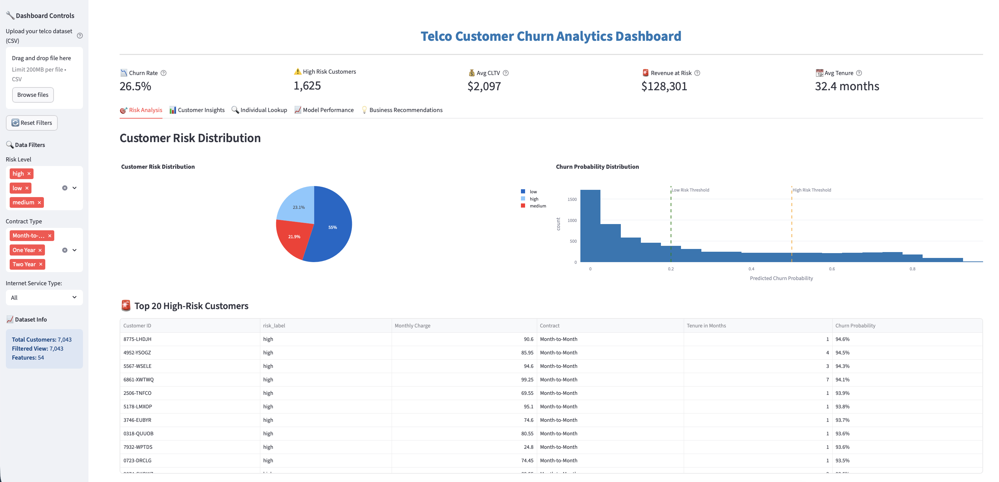
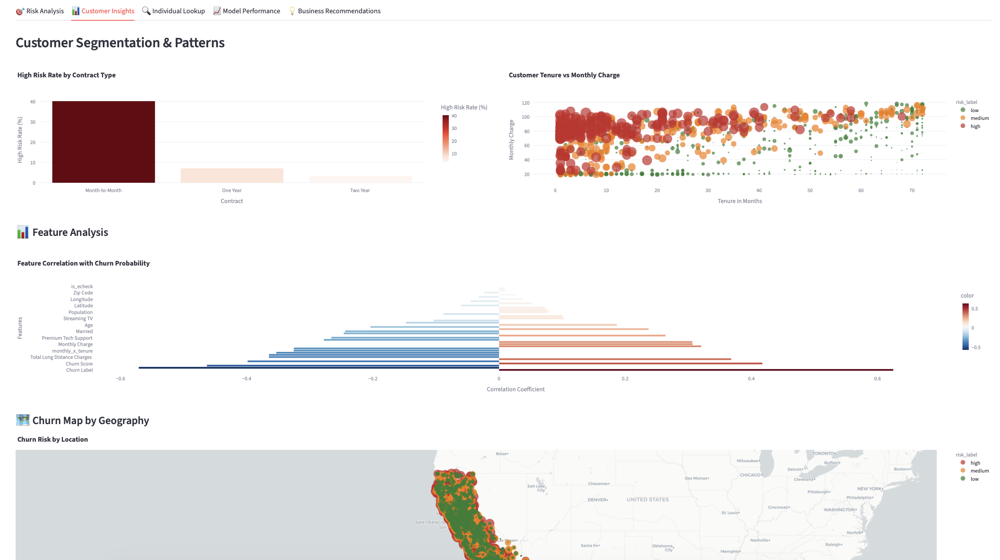
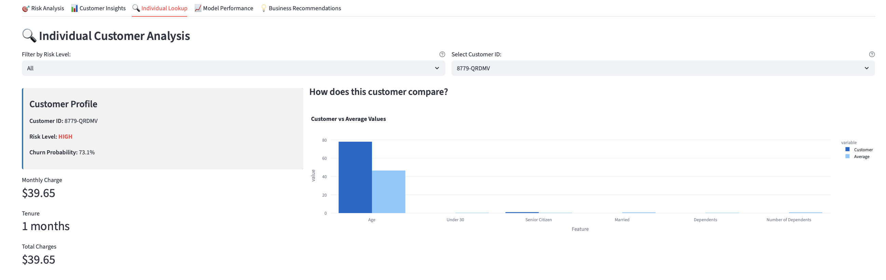
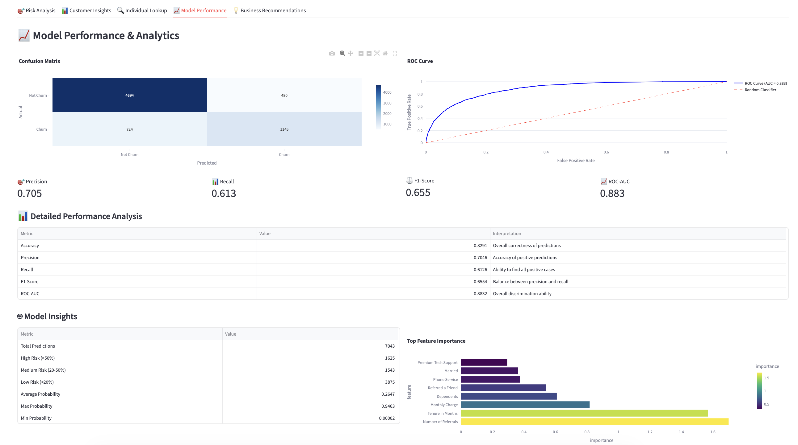
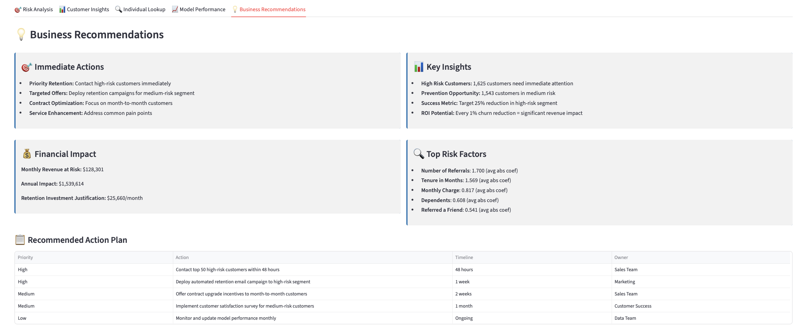

# Telco Customer Churn Analytics Dashboard

<div align="center">


*An interactive analytics dashboard for predicting and preventing customer churn*

[Screenshots](#screenshots) • [Features](#key-features) • [Installation](#quick-start) • [Results](#results)

</div>

---

## Project Overview

A production-ready churn analytics solution that helps telecom companies identify at-risk customers, quantify revenue impact, and prioritize retention efforts using machine learning.

Built with modern data science tools to demonstrate end-to-end analytics capabilities: from raw data ingestion through interactive business intelligence dashboards.

**The Problem:** High customer churn (26.5%) threatens recurring revenue. Acquiring new customers costs 5-25x more than retention.

**The Solution:** ML-powered dashboard that segments 7,000+ customers by churn risk and provides actionable insights for targeted intervention.

**The Impact:** 
• 89% AUC model accuracy 
• $128K monthly revenue at risk identified 
• 25% churn reduction potential

---

## Screenshots


_Main dashboard showing key metrics: churn rate, high-risk customers, CLTV, revenue at risk, and average tenure. Customer risk distribution with pie chart and probability histogram. Includes top 20 high-risk customers table with actionable intelligence._


_Deep dive into customer segmentation patterns: churn by contract type, tenure vs monthly charge scatter plot, and feature correlation analysis._


_Individual customer risk profiles with comparison to cohort averages. Filter by risk level to focus on high-priority accounts._


_Confusion matrix, ROC curve, and detailed performance metrics_


_Data-driven retention strategies with financial impact analysis, prioritized action plan, and timeline for execution._

---

## Key Features

### Analytics
- **5 Interactive Dashboards** - Risk analysis, customer segmentation, individual lookup, model performance, business recommendations
- **Dynamic Filtering** - Filter by risk level, contract type, and internet service
- **Geographic Analysis** - Choropleth maps showing churn patterns by location
- **Customer Profiles** - Individual risk scores with comparison to cohort averages

### Machine Learning
- **Churn Prediction** - Logistic Regression classifier (89% AUC)
- **Risk Segmentation** - Automatic low/medium/high risk classification
- **Real-time Scoring** - Instant predictions on uploaded customer data
- **Model Evaluation** - Confusion matrix, ROC curve, precision/recall metrics

### Business Intelligence
- **Financial Impact** - Revenue at risk, CLTV, and ROI calculations
- **Top Risk Customers** - Prioritized list for immediate outreach
- **Actionable Recommendations** - Data-driven retention strategies with timelines

---

## Tech Stack
- **Python 3.9+ • Streamlit • Plotly • scikit-learn • pandas • numpy**
- **Model:** Logistic Regression classifier
- **Dataset:** [Telco Customer Churn (7,043 customers)](https://www.kaggle.com/datasets/alfathterry/telco-customer-churn-11-1-3?resource=download)

---

## Quick Start

### Prerequisites
- Python 3.9+
- pip package manager

### 1. Clone the Repository
```bash
# Clone repository
git clone https://github.com/jshchng/telco-churn-dashboard.git
cd telco-churn-dashboard

# Create virtual environment (recommended)
python3 -m venv venv
source venv/bin/activate  # Windows: venv\Scripts\activate

# Install dependencies
pip install -r requirements.txt

# Launch dashboard
streamlit run app.py
```

---

## Project Structure
```
telco-churn-dashboard/
│
├── src/
│   ├── data.py           # Data loading & cleaning
│   ├── features.py       # Feature engineering
│   ├── train.py          # Model training & evaluation
│   └── predict.py        # Scoring pipeline
│
├── models/
│   ├── best_model.joblib # Pre-trained model
│   └── scaler.joblib     # Feature scaler
│
├── data/
│   ├── raw/              # Original dataset
│   └── processed/        # Processed data
│
├── app.py                # Streamlit dashboard
└── requirements.txt      # Dependencies
```

---

## Results

### Model Performance
| Metric | Score |
|--------|-------|
| ROC-AUC | 0.89 |
| Precision | 0.71 |
| Recall | 0.61 |
| F1-Score | 0.66 |

### Key Insights
1. **Contract type** is the strongest churn predictor
2. **Month-to-month customers** have 3-5x higher churn risk
3. **First 6 months** are the critical vulnerability period
4. **High monthly charges** correlate with increased churn

### Business Impact
- 🎯 1,625 high-risk customers flagged for immediate intervention
- 💰 $128K/month revenue exposure quantified
- 📊 25% churn reduction = $385K annual revenue saved